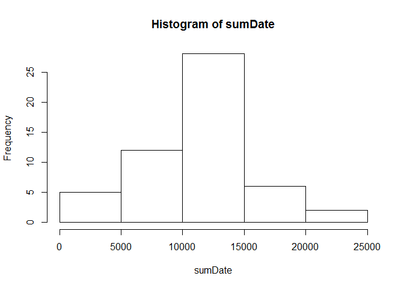
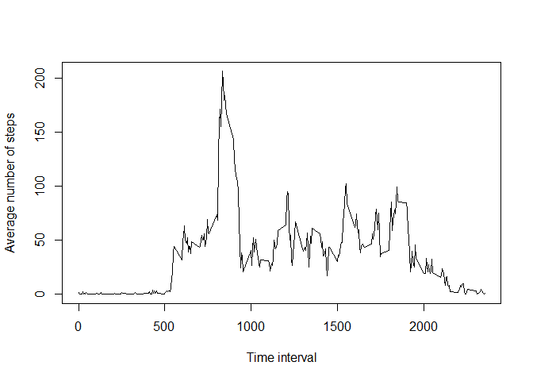

# Reproducible Research: Peer Assessment 1

```r
setwd("D:/Coursera/RProgramming/Repicable/RepData_PeerAssessment1")
```

## Loading and preprocessing the data

```r
data<- read.csv("activity.csv",stringsAsFactors=FALSE)
str(data)
```

```
## 'data.frame':	17568 obs. of  3 variables:
##  $ steps   : int  NA NA NA NA NA NA NA NA NA NA ...
##  $ date    : chr  "2012-10-01" "2012-10-01" "2012-10-01" "2012-10-01" ...
##  $ interval: int  0 5 10 15 20 25 30 35 40 45 ...
```

```r
data$date<-as.Date(data$date)
```


## What is mean total number of steps taken per day?

1. Make a histogram of the total number of steps taken each day


```r
sumDate<-tapply(data$steps,data$date,sum) 
hist(sumDate,main = paste("Histogram of total number of stpes"))
```

 

2. Calculate and report the **mean** and **median** total number of steps taken per day 

```r
mean(sumDate, na.rm=TRUE)
```

```
## [1] 10766.19
```

```r
median(sumDate, na.rm=TRUE)
```

```
## [1] 10765
```


## What is the average daily activity pattern?
1. Make a time series plot (i.e. `type = "l"`) of the 5-minute interval (x-axis) and the average number of steps taken, averaged across all days (y-axis)

```r
dat <- aggregate(steps ~ interval, data, mean)
plot(dat$interval,dat$steps,type="l",xlab="Time interval", ylab="Average number of steps")
```

 


2. Which 5-minute interval, on average across all the days in the dataset, contains the maximum number of steps?


```r
subset(dat,steps==max(steps),select=interval)
```

```
##     interval
## 104      835
```
## Imputing missing values


## Are there differences in activity patterns between weekdays and weekends?
