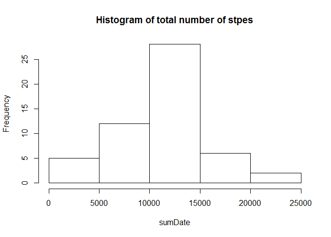

# Reproducible Research: Peer Assessment 1

```r
setwd("D:/Coursera/RProgramming/Repicable/RepData_PeerAssessment1")
```

## Loading and preprocessing the data

```r
data<- read.csv("activity.csv",stringsAsFactors=FALSE)
str(data)
```

```
## 'data.frame':	17568 obs. of  3 variables:
##  $ steps   : int  NA NA NA NA NA NA NA NA NA NA ...
##  $ date    : chr  "2012-10-01" "2012-10-01" "2012-10-01" "2012-10-01" ...
##  $ interval: int  0 5 10 15 20 25 30 35 40 45 ...
```

```r
data$date<-as.Date(data$date)
```


## What is mean total number of steps taken per day?

1. Make a histogram of the total number of steps taken each day


```r
sumDate<-tapply(data$steps,data$date,sum) 
hist(sumDate,main = paste("Histogram of total number of stpes"))
```

 

2. Calculate and report the **mean** and **median** total number of steps taken per day 

```r
mean(sumDate, na.rm=TRUE)
```

```
## [1] 10766.19
```

```r
median(sumDate, na.rm=TRUE)
```

```
## [1] 10765
```


## What is the average daily activity pattern?
1. Make a time series plot (i.e. `type = "l"`) of the 5-minute interval (x-axis) and the average number of steps taken, averaged across all days (y-axis)

```r
dat <- aggregate(steps ~ interval, data, mean)
plot(dat$interval,dat$steps,type="l",xlab="Time interval", ylab="Average number of steps")
```

 


2. Which 5-minute interval, on average across all the days in the dataset, contains the maximum number of steps?


```r
subset(dat,steps==max(steps),select=interval)
```

```
##     interval
## 104      835
```
## Imputing missing values
1. Calculate and report the total number of missing values in the dataset (i.e. the total number of rows with `NA`s)


```r
length(which(is.na(data$steps)))
```

```
## [1] 2304
```

Missing value will fill by median value of each time interval of the day

```r
temmedian<- aggregate(steps ~ interval, data, median)
tem<-merge(x=data,y=temmedian,by="interval",all.x=TRUE)
names(tem)
```

```
## [1] "interval" "steps.x"  "date"     "steps.y"
```

```r
for (i in 1:nrow(tem)){
        if (is.na(tem$steps.x[i])){
                tem$steps[i]<-tem$steps.y[i]
        }else{
                tem$steps[i]<-tem$steps.x[i]
        }
        
}
nonNA<-tem[,c(1,3,5)]
```
A histogram of the total number of steps taken each day and Calculate and report the mean and median 

```r
totalSteps<-tapply(nonNA$steps,nonNA$date,sum) 
hist(totalSteps,main = paste("Histogram of total number of stpes from Non NA dataset"))
```

 

```r
mean(totalSteps)
```

```
## [1] 9503.869
```

```r
median(totalSteps)
```

```
## [1] 10395
```
The histogram from new dataset where NA were replace with the median value of the same time interval each day, only one different we see is the frequency of 0 increase. When compute mean and median value from the new dataset both of them are decrese to 9503.869 and 10395 respectively as because number of N is increase where the value of them is 0. 


## Are there differences in activity patterns between weekdays and weekends?
Create weekday variable

```r
nonNA$day<-weekdays(nonNA$date)
nonNA$weekday[nonNA$day %in% c("Monday","Tuesday", "Wednesday", "Thursday", "Friday")] <- "Weekdays"
nonNA$weekday[nonNA$day %in% c("Saturday","Sunday")] <- "Weekend" 
weekday = factor(nonNA$weekday,levels=c("Weekdays","Weekend"))
```


```r
library(ggplot2)

dataplot <- aggregate(steps ~ interval+weekday , nonNA, mean)
dataplot$weekday<-as.factor(dataplot$weekday)

p<-ggplot(dataplot, aes(x=interval, y=steps, group=weekday))
p + geom_line(aes(colour = weekday)) + facet_grid(weekday ~ .) 
```

 
